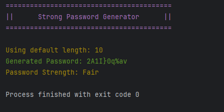

# PasswordGenerator
Simple command-line application that **generates strong passwords** based on real-world rules. This tool ensures character variety, uniqueness, and minimum length constraints to help the user to create better passwords.

---

## Features
- Generate strong, unique passwords using:
  - Uppercase & lowercase letters
  - Digits
  - Special symbols
- Strength evaluation based on:
  - Length
  - Character variety
  - Uniqueness ratio
- Categorizes passwords as:
  - Weak, Fair, Strong, Very Strong
- Default or custom password length
- Colored CLI output

---
## Base Structure

-  `Main`: Entry point of the application
-  `cli.CLIRunner`: Handles input validation, feedback, and logging
-  `service.*`: Business logic for password generation and strength evaluation
-  `model.enums.*`:	Enum definitions for color, size ranges, strength levels, etc.
-  `model.dto.*`: Data transfer object for character sets
-  `util.*`: Utilities for logging, character pool setup, strength analysis
-  `exception.*`: Custom application-specific exception

---

## Build & Run

### Requirements
- Java 21+

### Build (using javac)
You can build the application using either:
- Windows (build.bat)

```build.bat ```

- Unix/macOS (build.sh)
```
chmod +x build.sh
./build.sh
```
This will:
- Compile all .java files from src/main/java
- Output .class files to the out/ directory
- Package them into a runnable JAR at dist/password-generator.jar

### Run
Once built, run the application using:
```
java -jar dist/password-generator.jar [length]
```
### Arguments
- [length] (optional) – desired password length
- If no argument is provided, a default length is used.

## Example Output
  